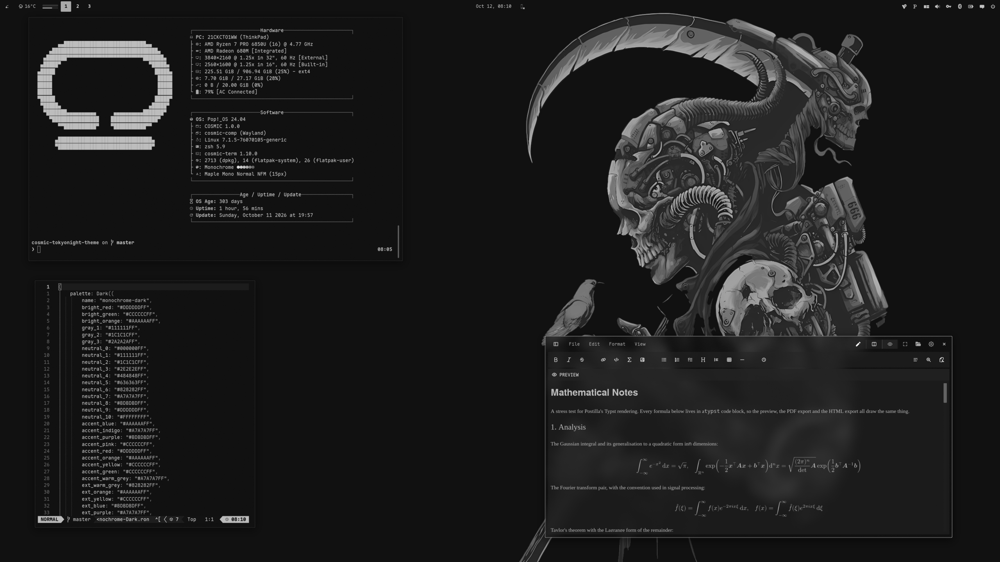
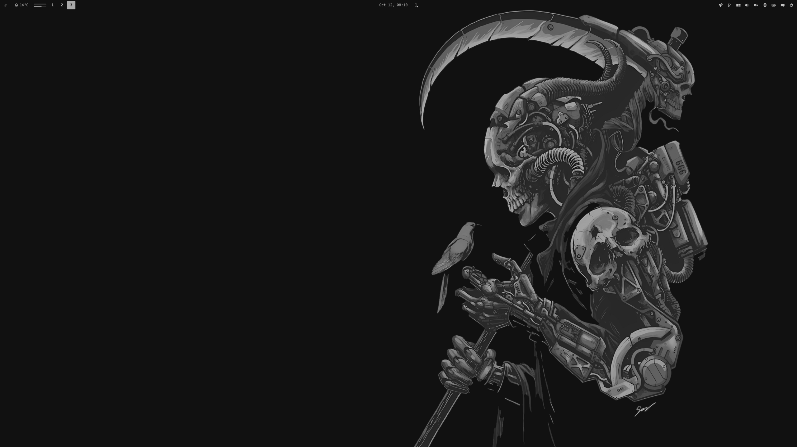

<div align="center">

# COSMIC · Monochrome


Pop!_OS 24.04 on COSMIC in grays only: desktop, terminal, shell, Firefox, Brave, cursor. The dark half of a pair;
the light half is [cosmic-monochromeday-theme](https://github.com/atraxsrc/cosmic-monochromeday-theme).


[](https://atraxsrc.github.io/cosmic-rices/)


</div>

---


## Palette

Sourced from the monochrome dark slots in
[claude-desktop-extra](https://github.com/patrickjaja/claude-desktop-extra/blob/master/themes/palettes/monochrome.svg).

| Role | Color | Hex |
|------|-------|-----|
| Background |  Void |  `#111111` |
| Elevated |  Surface |  `#1c1c1c` |
| Text |  Mute |  `#828282` |
| Primary |  Accent |  `#aaaaaa` |
| Secondary |  Control |  `#a7a7a7` |
| Border |  Edge |  `#bdbdbd` |
| Success |  High |  `#cccccc` |
| Error |  Higher |  `#dddddd` |

| Role | Monochrome | Monochrome Day |
|------|---|---|
| Background |  `#111111` |  `#E6E6E6` |
| Text |  `#BDBDBD` |  `#1A1A1A` |
| Accent |  `#AAAAAA` |  `#5C5C5C` |
| Success |  `#CCCCCC` |  `#515151` |
| Error |  `#DDDDDD` |  `#424242` |

There is no hue. Status colours are lighter grays, not green / red.

---

## Repo Structure

```
.
├── assets
│   ├── cursors/                 # cursor previews
│   ├── cosmic-term/             # scheme previews for cosmic-term/README.md
│   ├── palette.png              # the 16 terminal colours, under the title
│   ├── screenshot.png           # README screenshot
│   └── wallpaper.png            # the reaper on the bare desktop
├── backgrounds/                 # wallpapers, monochrome-<subject>.png (see Icons and wallpaper)
├── alacritty
│   ├── monochrome.toml          # Alacritty colour scheme
│   └── install.sh
├── bat
│   ├── Monochrome.tmTheme       # bat syntax theme (delta uses it too)
│   ├── config                   # --theme="Monochrome"
│   └── install.sh
├── brave
│   ├── theme                    # Chromium theme (manifest + icons), Load unpacked
│   └── README.md
├── btop
│   └── Monochrome.theme         # btop colour theme
├── claude-desktop
│   ├── cosmic-monochrome.jsonc  # Claude Desktop theme (claude-desktop-extra), dark + light
│   └── install.sh
├── cosmic
│   ├── Monochrome-Dark.ron      # COSMIC Appearance import
│   ├── config/                  # baseline settings: fonts, icons, terminal look
│   └── install.sh
├── cosmic-term
│   └── Monochrome-Dark-term.ron # COSMIC Terminal colour scheme
├── cursors
│   ├── Oxygen-Monochrome-*/      # cursor themes, one per icon colour, patched for COSMIC apps
│   ├── install.sh
│   ├── uninstall.sh
│   └── README.md
├── delta
│   ├── monochrome.gitconfig     # delta (git pager) colours, [include] it from ~/.gitconfig
│   └── install.sh
├── discord
│   ├── cosmic-monochrome.theme.css # Vencord / Vesktop theme, Monochrome (dark) + Monochrome Day (light)
│   └── install.sh
├── ghostty
│   ├── Monochrome               # Ghostty theme
│   └── install.sh
├── gtk
│   ├── monochrome.css           # GTK 3 / 4 named colours for non-COSMIC apps
│   └── install.sh
├── helix
│   ├── monochrome.toml          # Helix theme
│   └── install.sh
├── icons
│   └── install.sh               # Cosmic-Monochrome icon pack from cosmic-icon-themes
├── fastfetch
│   ├── config.jsonc             # gray fastfetch config
│   ├── cosmic.txt               # COSMIC logo
│   └── install.sh
├── firefox
│   ├── theme                    # Cosmic Monochrome theme add-on (manifest + icons)
│   ├── chrome
│   │   ├── userChrome.css       # rounded chrome, grey menu hover
│   │   └── userContent.css      # new tab accents, blank tiles
│   ├── install.sh
│   └── README.md
├── kitty
│   ├── Monochrome.conf          # kitty colour scheme
│   └── install.sh
├── lazygit
│   ├── monochrome.yml           # lazygit colours only, stacked on your config.yml
│   └── install.sh
├── lsd
│   ├── config.yaml              # theme: custom
│   ├── colors.yaml              # permission / size / date / git columns
│   └── install.sh
├── notesnook
│   └── cosmic-monochrome.json   # Notesnook theme, Monochrome (dark)
├── nvim                         # Neovim colorscheme, LazyVim spec, RON syntax, install.sh
├── obsidian
│   ├── cosmic-monochrome.css    # CSS snippet, Monochrome (dark) + Monochrome Day (light)
│   └── install.sh
├── qt
│   ├── Monochrome.conf          # qt5ct / qt6ct colour scheme
│   └── install.sh
├── starship
│   ├── starship.toml            # prompt, palette colours
│   └── install.sh
├── telegram
│   ├── colors.tdesktop-theme    # Telegram Desktop colour scheme (source)
│   ├── cosmic-monochrome.tdesktop-theme  # built theme, open this in Telegram
│   └── build.sh                 # rebuilds it, optionally with a wallpaper
├── vscode
│   ├── themes/                  # Cursor / VS Code colour themes, Monochrome (dark) + Monochrome Day (light)
│   ├── package.json             # extension manifest
│   ├── install.sh               # packs a .vsix, installs it with cursor --install-extension
│   └── README.md
├── scripts
│   ├── update_system.sh         # nala + flatpak, monochrome ANSI
│   └── switch.sh                # make this the active rice (see Switching rice)
├── wezterm
│   ├── monochrome.lua           # WezTerm colours, config.colors = require("monochrome")
│   └── install.sh
├── zsh
│   ├── monochrome.zsh           # LS_COLORS, highlighting colours, aliases, starship, lazygit
│   └── install.sh
├── docs
│   └── showcase.md              # the rice describing itself, for the Postilla pane of the screenshot
├── LICENSE
└── README.md
```

---

## COSMIC Desktop

Settings → Desktop → Appearance → **Dark** → **Import** → `cosmic/Monochrome-Dark.ron`

Or from a terminal in this folder, which takes the whole file:

```bash
cosmic-settings appearance import cosmic/Monochrome-Dark.ron
```

Since the COSMIC builds after 1.11.0 the **Import** button keeps your current
frosted glass (level, on/off per surface, opacity), gaps and active hint, and
takes only the colours, corners, fonts and icons from the file. The terminal
command applies this rice's frosted glass too, and so does `themebox flip`.

Accent tiles will all be gray. That is the theme. Use the `+` control if you want a custom swatch.

Frosted glass is on in the `.ron` at `frosted: Low` with an opacity table of
0.66 to 0.96, tinted with the palette's middle neutral, for windows, panel,
applets and system UI (maximized apps stay solid), and corners are squared
(`radius_*: 2.0`), the same as the DarkGold baseline. Adjust frosted glass on
Appearance → Style → Frosted glass after import; the Import button keeps those sliders.

Export from Appearance if you tweak backgrounds / tints so you do not lose them.

Pairing tip: import `MonochromeDay.ron` from
[cosmic-monochromeday-theme](https://github.com/atraxsrc/cosmic-monochromeday-theme) into the
Light slot and COSMIC's Dark / Light toggle flips between the two. Wallpaper,
Firefox and the shell layer do not follow the toggle; those are per-rice files.

### Baseline settings

`cosmic/config/` holds the settings that make up the look and rarely change
(panel, dock, applets and shortcuts are left out on purpose):

| Where | Setting |
|-------|---------|
| Fonts | Interface `Maple Mono Normal`, monospace `Maple Mono Normal NFM` |
| Icons | Cosmic-Monochrome-Dark |
| Windows | Minimize / maximize buttons hidden, theme applied to GNOME apps |
| Terminal | Maple Mono 15 (weights 500 / bold 800 / dim 300), 77% opacity, no header bar, Monochrome Dark |

Install the [Maple fonts](https://github.com/subframe7536/maple-font/releases)
(Maple Mono Normal and Maple Mono Normal NFM) and the Cosmic-Monochrome icons
(see Icons below) and import the terminal scheme first, then:

```bash
./cosmic/install.sh
```

It backs up each file it replaces to `*.bak` and COSMIC applies it live.

---

## COSMIC Terminal

The desktop `.ron` does not colour ANSI text.

1. COSMIC Terminal → **View → Color schemes…** (not Settings → Appearance)
2. Dark tab → **Import** → `cosmic-term/Monochrome-Dark-term.ron`
3. View → Settings → Appearance → Color scheme (dark) → **Monochrome Dark**

If a profile is set as default, set the scheme on that profile too or the dropdown will look like it did nothing.

If edge grey is not the plain text you want, there are five other variants
with the same ANSI colours, from Mute  `#828282` to
Higher  `#DDDDDD`. Previews and which to
pick: [`cosmic-term/README.md`](cosmic-term/README.md).

---

## Firefox

Two layers:

1. **Theme (colours):** install
   **[cosmic-monochrome-theme on addons.mozilla.org](https://addons.mozilla.org/en-US/firefox/addon/cosmic-monochrome-theme/)**.
   This is the main look.
2. **Stylesheets (optional):** `firefox/chrome/` adds rounded corners, grey
   menu hover, grey accents and blank new-tab tiles on top of the add-on
   (they also work with Firefox's built-in Dark theme):

```bash
./firefox/install.sh
```

Fully quit Firefox afterward. Details and CSS rules: [`firefox/README.md`](firefox/README.md).

---

## Brave

`brave/theme` is a Chromium theme with the Firefox theme's colours: black
frame, charcoal toolbar, grey icons and inactive tabs, bright grey on the active tab.
Brave, Chrome, Chromium and Edge take it, and it loads straight from the
clone, so no Chrome Web Store or Google account is needed:

`brave://extensions` → **Developer mode** → **Load unpacked** → `brave/theme`

Leave the clone in place, Brave keeps reading the folder. Colours, limits and
packing a `.crx`: [`brave/README.md`](brave/README.md).

---

## Claude Desktop

For the unofficial [claude-desktop-extra](https://github.com/patrickjaja/claude-desktop-extra)
Linux build. `claude-desktop/cosmic-monochrome.jsonc` is one theme with both halves:
Monochrome in dark mode and Monochrome Day in light mode, so Claude's own
Settings → Appearance toggle switches between the two rices.
Colours come from `cosmic/*.ron`, contrast-checked (text and button text
4.5:1, accents 3:1).

```bash
./claude-desktop/install.sh
```

It copies the file into `~/.config/Claude/themes.d/`. Then press
<kbd>Ctrl</kbd>+<kbd>Shift</kbd>+<kbd>T</kbd> in Claude Desktop and pick **cosmic-monochrome**.

The same file ships in [`cosmic-monochromeday-theme`](https://github.com/atraxsrc/cosmic-monochromeday-theme),
so installing from either repo gives the same theme.

---

## Cursor editor

`vscode/` is a colour theme extension for [Cursor](https://cursor.com) with
both halves of the pair: **Cosmic Monochrome** and **Cosmic Monochrome Day**. It is a
plain VS Code theme extension, so VS Code and VSCodium take it too, and the
same extension ships in cosmic-monochromeday-theme. Code is coloured the way Neovim is
in this rice; the workbench takes the desktop's window and
container colours, with the accent on the active tab, buttons and menu
highlight, and the integrated terminal uses the COSMIC Terminal scheme. Cursor
builds its Agent and chat panels from the same theme colours, so they follow
along.

```bash
./vscode/install.sh
```

It packs `vscode/` into a `.vsix` and installs it with
`cursor --install-extension`; run it again after editing the theme. Then press
<kbd>Ctrl</kbd>+<kbd>K</kbd> <kbd>Ctrl</kbd>+<kbd>T</kbd> in Cursor and pick
**Cosmic Monochrome**. Three lines in Cursor's `settings.json` make it follow
COSMIC's Dark / Light toggle between Monochrome and Monochrome Day; they, the colours and
the contrast notes are in [`vscode/README.md`](vscode/README.md).

---

## Telegram

`telegram/cosmic-monochrome.tdesktop-theme` is a Telegram Desktop theme: void
chat list and background, surface incoming and grey outgoing bubbles, the grey
accent for links, unread badges and buttons (with void text on them). Group
member names are greys too, like the rest of the rice. Text and badge colours
are contrast-checked at 4.5:1 or better, except disabled menu items.

Settings → Chat Settings → Chat wallpaper → **Choose from file** →
`telegram/cosmic-monochrome.tdesktop-theme` → **Apply this theme**.

The colours live in `telegram/colors.tdesktop-theme`, which is plain text;
`build.sh` zips it with the chat background into the `.tdesktop-theme`. The
background is the plain window colour; to put a wallpaper behind the chat instead
(ImageMagick re-encodes it to a 2560px JPEG, Telegram caps theme files at 5 MB):

```bash
./telegram/build.sh --wallpaper backgrounds/monochrome-anime.png
```

Built against Telegram Desktop 7.3.1. Calls, group calls, statistics charts and
premium badges keep Telegram's own colours.

Telegram has no dark / light pairing, so Monochrome Day, the light half, ships its
own theme.

---

## Scripts

### `update_system.sh`

nala + flatpak updater. Headers, success, and the figlet ramp are gray.

```bash
chmod +x scripts/update_system.sh
./scripts/update_system.sh
```

### `switch.sh`

Makes this the active rice, coming from any other `cosmic-*-theme` rice. See
[Switching rice](#switching-rice).

```bash
./scripts/switch.sh
```

---

## Terminal extras

Need a [Nerd Font](https://www.nerdfonts.com/) in the terminal for the icons
(Maple Mono NFM in the baseline above).

### kitty, Alacritty, WezTerm, Ghostty

The COSMIC Terminal scheme for other terminals, one file each with the same
sixteen ANSI colours, text in  `#BDBDBD`, the cursor in  `#AAAAAA` and the
selection on  `#393939`. Each installer copies the file next to that terminal's
config and backs up what it replaces; the one include line you add is
printed, and is in the comment at the top of each file:

```bash
./kitty/install.sh        # ~/.config/kitty/themes/Monochrome.conf       kitty.conf:     include themes/Monochrome.conf
./alacritty/install.sh    # ~/.config/alacritty/themes/monochrome.toml   alacritty.toml: [general] import = ["~/.config/alacritty/themes/monochrome.toml"]
./wezterm/install.sh      # ~/.config/wezterm/monochrome.lua             wezterm.lua:    config.colors = require("monochrome")
./ghostty/install.sh      # ~/.config/ghostty/themes/Monochrome          config:         theme = Monochrome
```

Ghostty and WezTerm can follow COSMIC's Dark / Light toggle once the Monochrome Day
half is installed from its repo as well: `theme = dark:Monochrome,light:MonochromeDay` in
Ghostty, and in WezTerm

```lua
local dark = (wezterm.gui and wezterm.gui.get_appearance() or "Dark"):find("Dark")
config.colors = require(dark and "monochrome" or "monochromeday")
```

kitty and Alacritty have no such switch; include the other file instead.

### starship

`starship/starship.toml` is close to the defaults with the palette declared
once as `[palettes.monochrome]` and used by name: the directory in  `#A7A7A7`,
the branch in  `#CCCCCC`,  `#AAAAAA` for a dirty tree, a  `#CCCCCC` prompt
character that turns  `#DDDDDD` after a failed command. Modules it does not style keep their defaults, which use the ANSI
slots the COSMIC Terminal scheme colours. `zsh/monochrome.zsh` already runs
`starship init`. `install.sh` backs up any existing `~/.config/starship.toml`
to `starship.toml.bak`.

```bash
./starship/install.sh
```

### bat

`bat/Monochrome.tmTheme` is a syntax theme coloured the way Neovim is in this
rice: keywords in  `#DDDDDD`, strings in  `#AAAAAA`, functions in  `#CCCCCC`, numbers
in  `#BDBDBD`, types in  `#A7A7A7`, imports and escapes in  `#DDDDDD`, italic
comments in  `#636363`, on the editor background  `#111111`. `zsh/monochrome.zsh`
aliases `cat` to bat. `install.sh` copies the theme to `~/.config/bat/themes/`,
rebuilds bat's cache so bat and delta can find it, and sets `--theme="Monochrome"`
in `~/.config/bat/config` (backup in `config.bak`).

```bash
./bat/install.sh
batcat README.md
```

### delta

`delta/monochrome.gitconfig` colours [delta](https://github.com/dandavison/delta),
the git diff pager: removed lines in  `#DDDDDD` and added lines in
 `#CCCCCC` on the container  `#1C1C1C`, changed words on a solid block of
those two colours with  `#111111` text, the same as Neovim's diff highlights;
file names in  `#AAAAAA`, commit hashes in  `#CCCCCC`, hunk headers in
 `#A7A7A7` inside  `#484848` boxes, line numbers. Code inside the diff
uses the bat theme above, so install that first. `install.sh` copies the file
to `~/.config/delta/` and prints the `[include]` to add to `~/.gitconfig`; it
never edits that file.

```bash
./delta/install.sh
```

```ini
# ~/.gitconfig
[include]
    path = ~/.config/delta/monochrome.gitconfig
[core]
    pager = delta
[interactive]
    diffFilter = delta --color-only
```

### lazygit

`lazygit/monochrome.yml` holds only the `gui.theme` block: active border in
 `#AAAAAA`, inactive borders in  `#484848`, the selected line on  `#2A2A2A`,
 `#CCCCCC` and  `#CCCCCC` marks for cherry-picked and base commits,
unstaged changes in  `#DDDDDD`, author names in  `#CCCCCC`. lazygit reads one
config file, so instead of replacing your `~/.config/lazygit/config.yml` the
installer drops the theme beside it and `zsh/monochrome.zsh` sets `LG_CONFIG_FILE`
to both, your file first, so the colours win and your keybindings stay.

```bash
./lazygit/install.sh
exec zsh
```

Without the zsh layer, export it yourself:
`LG_CONFIG_FILE="$HOME/.config/lazygit/config.yml,$HOME/.config/lazygit/monochrome.yml"`.

### Helix

`helix/monochrome.toml` is the Neovim colorscheme for [Helix](https://helix-editor.com/):
same syntax roles, editor on  `#111111`, status line and popups on  `#1C1C1C`,
cursor and current line number in  `#AAAAAA`, the mode shown as a solid
 `#AAAAAA` /  `#CCCCCC` /  `#CCCCCC` block. `install.sh` copies it to
`~/.config/helix/themes/`.

```bash
./helix/install.sh
# ~/.config/helix/config.toml:  theme = "monochrome"
```

### zsh

`zsh/monochrome.zsh` is the rice part of the shell only: `LS_COLORS` (also
used by lsd for file names and by the completion menu), gray colours for
zsh-autosuggestions and zsh-syntax-highlighting, lsd / bat / nvim aliases, the lazygit theme file and
the starship prompt. With no hue, bold / italic / underline tell file types
and errors apart. Your own `~/.zshrc` stays private and sources it.

Needs zsh + [oh-my-zsh](https://ohmyz.sh/). `install.sh` clones the two
plugins if missing and appends one `source` line to `~/.zshrc` (backup in
`~/.zshrc.bak`):

```bash
./zsh/install.sh
exec zsh
```

In `~/.zshrc` keep `ZSH_THEME=""` and
`plugins=(git sudo zsh-autosuggestions zsh-syntax-highlighting)`.

### lsd

File names are coloured by `LS_COLORS` from `zsh/monochrome.zsh`;
`lsd/colors.yaml` colours the other columns with the 256-colour grays nearest
the palette (253  `#dddddd`, 252  `#cccccc`, 250  `#bdbdbd`, 248  `#aaaaaa`,
244  `#828282`, 241  `#636363`). lsd 1.0.0 does not accept `#hex` there.

```bash
./lsd/install.sh
lsd -l
```

### fastfetch

COSMIC logo and Hardware / Software / Age boxes in grays. `install.sh` backs
up any existing `~/.config/fastfetch/config.jsonc` to `config.jsonc.bak`.

```bash
./fastfetch/install.sh
fastfetch
```

### Neovim

`nvim/` carries the rice into Neovim: a dependency-free colorscheme built from
the palette (`nvim/colors/monochrome.lua`), a LazyVim spec that selects it and makes
sure the treesitter parsers for the files in this repo are installed
(`nvim/lua/plugins/monochrome.lua`), and a small RON syntax file so `cosmic/*.ron`
is coloured even before the parser exists. `:terminal` inside Neovim uses the
Monochrome Dark scheme.

```bash
./nvim/install.sh
# restart nvim; LazyVim switches to the monochrome colorscheme
```

Without LazyVim, copy `nvim/colors/monochrome.lua` to `~/.config/nvim/colors/` and
run `:colorscheme monochrome`.

### btop

`btop/Monochrome.theme`: near-black background, gray boxes, meters ramp from
dim gray to near-white.

```bash
mkdir -p ~/.config/btop/themes
cp btop/Monochrome.theme ~/.config/btop/themes/
# btop → Esc → Options → Color theme → Monochrome
```

---

## GTK and Qt apps

COSMIC colours GTK apps itself when Appearance → **Apply theme to GNOME apps**
is on (the baseline config turns it on). `gtk/monochrome.css` is the same palette
pinned by hand for GTK 3 and GTK 4 / libadwaita apps: windows and lists on
 `#111111`, cards, popovers and dialogs on  `#1C1C1C`, text in  `#BDBDBD`, selection
and accent in  `#AAAAAA` with  `#111111` text on it,  `#CCCCCC` for
success and  `#AAAAAA` for warnings. It only sets the named colours, so
widgets keep their stock shapes, and it also works where COSMIC's toggle does
not reach (another desktop, Flatpak apps given access to `~/.config/gtk-4.0`).

```bash
./gtk/install.sh
```

It copies the file to `~/.config/gtk-3.0/` and `~/.config/gtk-4.0/` and adds
`@import url("monochrome.css");` to `gtk.css` there, after COSMIC's own import so
these colours win (backup in `gtk.css.bak`); another rice's import is
commented out. Restart GTK apps.

`qt/Monochrome.conf` is a colour scheme for [qt5ct](https://github.com/desktop-app/qt5ct)
/ [qt6ct](https://github.com/trialuser02/qt6ct): windows on  `#111111`, text
fields and lists on  `#111111`, buttons and tooltips on  `#1C1C1C`, text in
 `#BDBDBD`,  `#AAAAAA` for the highlight and links, placeholders in  `#828282`,
disabled text in  `#636363`.

```bash
./qt/install.sh
# qt6ct → Appearance → Color scheme → Monochrome, Palette: Custom → Apply
```

Qt apps read it with `QT_QPA_PLATFORMTHEME=qt6ct` (or `qt5ct`) in the
environment; `~/.config/environment.d/` or your `~/.zshrc` is the place.

Text and secondary text read at 6.0:1 or better on the window, container and
field colours; disabled, placeholder and dim text, like comments elsewhere in
the rice, at 2.8:1.

---

## Obsidian

`obsidian/cosmic-monochrome.css` is a CSS snippet with both halves of the pair:
Monochrome in dark mode, Monochrome Day in light mode, so with Settings →
Appearance → Base color scheme → **Adapt to system** Obsidian follows COSMIC's
Dark / Light toggle. Editor on  `#111111`, sidebars on  `#1C1C1C`, text in  `#BDBDBD`,
links and accent in  `#AAAAAA`, headings coloured like Neovim's
( `#AAAAAA` /  `#CCCCCC` /  `#A7A7A7`), code and checkboxes in  `#AAAAAA`, tags
in  `#CCCCCC`. The same file ships in cosmic-monochromeday-theme.

```bash
./obsidian/install.sh ~/path/to/vault
# Settings → Appearance → CSS snippets → cosmic-monochrome
```

It copies the file into the vault's `.obsidian/snippets/`. Snippets are per
vault, so run it once per vault.

---

## Notesnook

`notesnook/cosmic-monochrome.json` is a [Notesnook](https://notesnook.com/) theme for Monochrome,
built from the same palette as the Obsidian snippet: window, list and sidebar
backgrounds, text, accent, selection and the error / success colours. A
Notesnook theme holds one colour scheme, so the Monochrome Day half ships as
`notesnook/cosmic-monochromeday.json` in cosmic-monochromeday-theme; load both if you switch between
dark and light.

```text
Notesnook → Settings → Appearance → Themes → Load from file
→ pick notesnook/cosmic-monochrome.json → Set as default
```

---

## Discord

`discord/cosmic-monochrome.theme.css` is a theme for [Vencord](https://vencord.dev/)
and [Vesktop](https://github.com/Vencord/Vesktop), colours only: chat on
 `#111111`, sidebars and inputs on  `#1C1C1C`, server list on  `#111111`, text in
 `#BDBDBD`, channel names in  `#A7A7A7`, accent, mentions and links in
 `#AAAAAA`,  `#CCCCCC` for online and positive,  `#AAAAAA` for
warnings. The light half is Monochrome Day and the dark half Monochrome, so
with Appearance → Theme → **Sync with computer** it follows COSMIC's toggle.
The same file ships in cosmic-monochromeday-theme.

```bash
./discord/install.sh
# Settings → Vencord → Themes → Load missing themes → Cosmic Monochrome
```

It copies the file into every Vencord and Vesktop config folder it finds:
`~/.config/Vencord/themes/`, `~/.config/vesktop/themes/`, and for the Flatpak
builds `~/.var/app/com.discordapp.Discord/config/Vencord/themes/` and
`~/.var/app/dev.vencord.Vesktop/config/vesktop/themes/`. Discord renames its CSS
variables now and then; the file sets both the long-standing names and the
2025 visual-refresh names. Text on the surfaces is 6.0:1 or better; the text on
Discord's own accent-coloured buttons stays its white, at 2.3:1.

---

## Cursor

**Oxygen** cursors recoloured to the icon colours, one per folder colour of the
Cosmic-Monochrome icon pack: **Silver** (default), **White**, **Dark**. Patched with the cursor
names COSMIC apps ask for. COSMIC has no cursor picker yet, so the script sets it:

```bash
./cursors/install.sh                      # Silver
./cursors/install.sh --variant White     # or another, see --list
reboot
```

Previews, what the script touches, how to undo it and how the colours are made:
[`cursors/README.md`](cursors/README.md).

---

## Icons and wallpaper

Icons: **Cosmic-Monochrome**, the [Kanagawa icons](https://github.com/Fausto-Korpsvart/Kanagawa-GKT-Theme/tree/main/icons/Kanagawa)
by Fausto Korpsvart recolored to this palette in
[cosmic-icon-themes](https://github.com/atraxsrc/cosmic-icon-themes). Folders come in
three colors: **Silver**  `#AAAAAA`, **White**  `#DDDDDD` and **Dark**  `#2A2A2A` (default) with light symbols.


```bash
./icons/install.sh                   # Dark folders
./icons/install.sh --variant Silver  # or White
```

It downloads the pack from the latest cosmic-icon-themes release, checks its SHA256,
installs it to `~/.local/share/icons/` and sets it as the COSMIC icon theme.
Restart open apps afterwards (Files caches icons per window).
Add `--system` to install to `/usr/share/icons` instead, for every user and the
login screen (asks for sudo); `--user` is the default.

Wallpapers ship in [`backgrounds/`](backgrounds/), named `monochrome-<subject>.png`:
the thirteen subjects every dark rice has, rendered in greys only:
the Harbor Dark reaper and Hyundai blueprint, the COSMIC astronaut, the samurai,
sushi switch, geisha, JS mug and neon street from the Tokyo Night set, The Greek
eagle and ink portrait, and three new scenes: city, panel and tower.
The reaper is the one in the screenshot.
The subjects come from [cool-wallpapers](https://github.com/atraxsrc/cool-wallpapers) (MIT); each was rendered again in this palette, then upscaled.

Settings → Wallpaper → Add image → a file from `backgrounds/`.



---

## Setup

```bash
git clone https://github.com/atraxsrc/cosmic-monochrome-theme.git
cd cosmic-monochrome-theme

# desktop
# Settings → Appearance → Dark → Import cosmic/Monochrome-Dark.ron

# terminal
# View → Color schemes → Import cosmic-term/Monochrome-Dark-term.ron

# firefox add-on
# https://addons.mozilla.org/en-US/firefox/addon/cosmic-monochrome-theme/

# optional extra chrome
./firefox/install.sh

# brave: brave://extensions → Developer mode → Load unpacked → brave/theme

# claude desktop (claude-desktop-extra), then Ctrl+Shift+T
./claude-desktop/install.sh

# cursor editor, then Ctrl+K Ctrl+T → Cosmic Monochrome
./vscode/install.sh

# telegram desktop
# Settings → Chat Settings → Chat wallpaper → Choose from file → telegram/cosmic-monochrome.tdesktop-theme

# shell + terminal tools (see Terminal extras above)
./zsh/install.sh
./lsd/install.sh
./fastfetch/install.sh
./nvim/install.sh
mkdir -p ~/.config/btop/themes && cp btop/Monochrome.theme ~/.config/btop/themes/

./starship/install.sh
./bat/install.sh
./delta/install.sh          # then the [include] it prints, in ~/.gitconfig
./lazygit/install.sh
./helix/install.sh          # then theme = "monochrome" in helix/config.toml

# other terminals, one include line each (see Terminal extras above)
./kitty/install.sh
./alacritty/install.sh
./wezterm/install.sh
./ghostty/install.sh

# gtk + qt apps (see GTK and Qt apps above)
./gtk/install.sh
./qt/install.sh             # then qt6ct → Color scheme → Monochrome

# obsidian + discord, both halves in one file (see above)
./obsidian/install.sh ~/path/to/vault
./discord/install.sh

# wallpaper
# Settings → Wallpaper → Add image → a file from backgrounds/ (see Icons and wallpaper above)

./cursors/install.sh                # cursor, Silver (see Cursor above), then reboot
./icons/install.sh                  # icons (see Icons above)
# Maple fonts (https://github.com/subframe7536/maple-font), then
# fonts, icons, terminal look from cosmic/config/
./cosmic/install.sh
```

---

## Switching rice

The installers replace what they own (with a `*.bak` copy), but some things
pile up instead: shell layers in `~/.zshrc`, LazyVim specs, the updater link and
btop's theme setting. `scripts/switch.sh` makes Monochrome the active rice, coming
from any other `cosmic-*-theme` rice, and tidies those up. Every rice repo ships
the same script.

```bash
./scripts/switch.sh               # switch, icons included
./scripts/switch.sh --keep-icons  # leave the current icon theme alone
```

It backs up every file it replaces, then:

- copies `cosmic/config/` (fonts, terminal look, icons) and turns dark mode on.
  The terminal scheme and icon theme are only replaced when the current one is
  not already a Monochrome variant, so a dimmer text variant or another icon colour
  survives. Icons stay as they are until `./icons/install.sh` has run.
- runs the fastfetch, lsd, bat, starship, delta, lazygit, kitty, Alacritty,
  WezTerm, Ghostty, Helix, GTK, Qt, Discord, Neovim and Claude Desktop
  installers and sets btop's `color_theme`. The terminal, editor and Qt
  installers only copy theme files; the include line you added once stays,
  switch it by hand when the file name differs between rices
- moves every other rice's LazyVim spec from `~/.config/nvim/lua/plugins/` to
  `~/.config/nvim/rice-off/` (LazyVim loads every spec there and the last
  colorscheme wins); your own specs stay
- comments out every other rice's `source` line in `~/.zshrc`, and
  cosmic-ricing's `ricing/zsh/colors.zsh`, then uncomments Monochrome's or adds it
- points `~/update_system.sh` at this repo's updater
- installs the Firefox userChrome / userContent

The GUI steps it cannot do are printed at the end:

1. Settings → Desktop → Appearance → Dark → Import `cosmic/Monochrome-Dark.ron`
2. COSMIC Terminal → View → Color schemes → Dark tab → Import `cosmic-term/Monochrome-Dark-term.ron`
3. Firefox: disable the old rice's add-on, enable [this one](https://addons.mozilla.org/en-US/firefox/addon/cosmic-monochrome-theme/), restart Firefox
4. Settings → Wallpaper → a file from `backgrounds/`
5. Claude Desktop: Ctrl+Shift+T → `cosmic-monochrome`, Appearance → Dark
6. `exec zsh`, restart Neovim (`:Lazy clean` drops plugins only the old specs used)
7. Obsidian: `./obsidian/install.sh <vault>`; delta: the `[include]` path in `~/.gitconfig`

Skip 1 and 2 when that slot already holds Monochrome. The first time on this rice,
run [Setup](#setup) once for the fonts, icons and cursor.

**Within the pair** (Monochrome ↔ [Monochrome Day](https://github.com/atraxsrc/cosmic-monochromeday-theme)): the two halves
sit side by side in COSMIC's Dark and Light slots and share one Claude Desktop
theme, so after the first time only the Firefox add-on and the wallpaper are
left by hand. Add `--keep-icons` to keep one icon colour across the pair.

Monochrome has no light half, so every switch to or from it is a full one.

Leaving Monochrome is the next rice's `./scripts/switch.sh`. `./cursors/uninstall.sh`
puts the Pop cursor back.

---

## Stack

| Tool | What it does |
|------|-------------|
| [Pop!_OS 24.04](https://pop.system76.com/) | Base OS by System76 |
| [COSMIC DE](https://system76.com/cosmic) | Desktop environment |
| [oh-my-zsh](https://ohmyz.sh/) | zsh framework + plugins |
| [lsd](https://github.com/lsd-rs/lsd) | `ls` with icons and colours |
| [fastfetch](https://github.com/fastfetch-cli/fastfetch) | System info |
| [btop](https://github.com/aristocratos/btop) | Resource monitor |
| [starship](https://starship.rs/) | Prompt |
| [bat](https://github.com/sharkdp/bat) | `cat` with syntax highlighting |
| [delta](https://github.com/dandavison/delta) | git diff pager |
| [lazygit](https://github.com/jesseduffield/lazygit) | git TUI |
| [Helix](https://helix-editor.com/) | Editor |
| [kitty](https://sw.kovidgoyal.net/kitty/), [Alacritty](https://alacritty.org/), [WezTerm](https://wezterm.org/), [Ghostty](https://ghostty.org/) | Other terminals |
| [qt6ct](https://github.com/trialuser02/qt6ct) | Qt colour scheme |
| [Vencord](https://vencord.dev/) / [Vesktop](https://github.com/Vencord/Vesktop) | Discord theme host |
| [cosmic-icon-themes](https://github.com/atraxsrc/cosmic-icon-themes) | Icon pack (Cosmic-Monochrome), recolored from [Kanagawa icons](https://github.com/Fausto-Korpsvart/Kanagawa-GKT-Theme/tree/main/icons/Kanagawa) |
| [Oxygen-Cursors](https://github.com/wo2ni/Oxygen-Cursors) | Cursor, recoloured to the icon colours |

## License

MIT. The cursor artwork keeps the terms of KDE's Oxygen project, see
[`cursors/README.md`](cursors/README.md).
